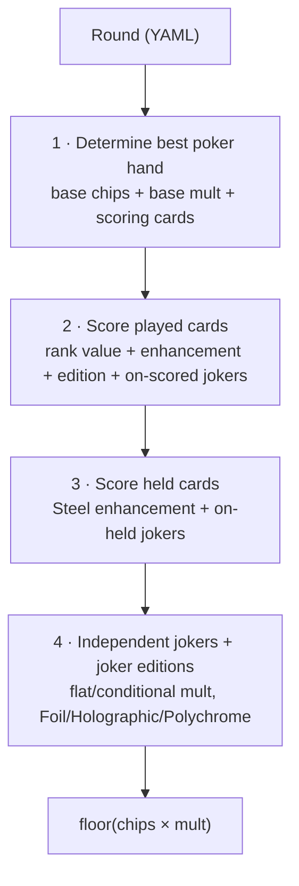

<div align="right">

**English** · [中文](./README.zh-CN.md)

</div>

# balatro_rust

> A Rust scoring engine that reimplements the card-scoring rules of *Balatro*: it reads a structured round (played cards, held cards, jokers) and computes the final score through a multi-stage pipeline.


---

## Table of contents

- [Overview](#overview)
- [Scoring pipeline](#scoring-pipeline)
- [Project structure](#project-structure)
- [Joker system design](#joker-system-design)
- [Hand evaluation](#hand-evaluation)
- [Complex rule interactions](#complex-rule-interactions)
- [Build & run](#build--run)
- [Input format](#input-format)
- [Testing](#testing)
- [Tech stack](#tech-stack)
- [Acknowledgements](#acknowledgements)
- [License](#license)

---

## Overview

`balatro_rust` takes a single round of *Balatro* described in YAML and deterministically computes its score. The interesting part is not arithmetic — it is **modelling a system whose rules interact**: jokers that change which poker hand is detected, jokers that retrigger cards, jokers that copy other jokers, and per-card editions and enhancements that all stack in a defined order.

The final score is `floor(chips × mult)`, where `chips` and `mult` are accumulated by walking the round through the pipeline below.

## Scoring pipeline

The entry point (`score`) runs four ordered stages. Each stage takes the running `(chips, mult)` and returns an updated pair, so the order of effects is explicit and testable.



1. **Determine the best hand** — find the highest-scoring poker hand the played cards can form, accounting for effect jokers that change detection (Four Fingers, Shortcut, Smeared). Returns base chips/mult and the subset of cards that actually score.
2. **Score played cards** — for each scoring card, add its rank value, then apply card enhancement and card edition; afterwards apply on-scored jokers.
3. **Score held cards** — apply the Steel enhancement and on-held jokers to cards still in hand.
4. **Independent jokers & editions** — apply jokers that score independently of specific cards, plus joker editions (Foil/Holographic before the joker effect, Polychrome after).

## Project structure

```
src/
├── main.rs                  # CLI entry; parse YAML round, run pipeline, print score
├── scoring.rs               # The 4-stage pipeline + retrigger / blueprint orchestration
├── util.rs                  # Rank counting, flush/straight detection, rank-to-numeric
├── poker/
│   ├── hand_determine.rs    # Poker-hand classification (highest → lowest, short-circuit)
│   ├── enhancement.rs       # Card enhancements: Bonus / Mult / Glass / Steel / Wild
│   └── edition.rs           # Foil / Holographic / Polychrome (cards and jokers)
└── jokers/
    ├── on_scored.rs         # Jokers that trigger when a card scores
    ├── on_held.rs           # Jokers that trigger on cards held in hand
    └── independent.rs       # Jokers that score independently of specific cards
```

## Joker system design

The core design decision is to organise jokers **by *when* they trigger**, not by which joker they are. This mirrors Balatro's own scoring model and keeps each joker's logic small and isolated. Three modules, each backed by a trait and a dispatcher:

| Module | Trait | Triggers | Examples |
| --- | --- | --- | --- |
| `on_scored.rs` | `OnScoredJokerEffect` | when a played card scores | Greedy / Lusty / Wrathful / Gluttonous, Fibonacci, Scary Face, Even Steven, Odd Todd, Photograph, Smiley Face, Sock and Buskin |
| `on_held.rs` | `OnHeldJokerEffect` | for cards held in hand | Raised Fist, Baron, Mime |
| `independent.rs` | `IdpJokerEffect` | once per round, card-independent | Joker, Jolly / Zany / Mad / Crazy / Droll, Sly / Wily / Clever / Devious / Crafty, Blackboard, Flower Pot, Abstract Joker |

Each joker is a zero-sized struct implementing its module's trait `apply(...)`, and a `get_*_joker_effect` function maps a `JokerCard` to the right boxed trait object (`Box<dyn …>`). Adding a new joker means adding one struct and one match arm — the pipeline itself never changes (open/closed principle).

## Hand evaluation

`determine_best_hand` checks poker hands from **highest to lowest** and short-circuits on the first match, so it always returns the best available hand:

```
Flush Five → Flush House → Five of a Kind → Straight Flush → Four of a Kind
→ Full House → Flush → Straight → Three of a Kind → Two Pair → Pair → High Card
```

Detection is parameterised by the effect jokers that bend the rules:

- **Four Fingers** — flushes and straights need only **4** cards instead of 5.
- **Shortcut** — straights may have a **gap of 2** between ranks (e.g. `5 7 9 J K`).
- **Smeared Joker** — suits merge by colour (♥/♦ and ♠/♣ count as the same suit) for flush detection.
- **Wild cards** — count as any suit when forming flushes.

Both **high-ace** (`10-J-Q-K-A`) and **low-ace** (`A-2-3-4-5`) straights are handled explicitly.

## Complex rule interactions

The parts that make the engine non-trivial:

- **Retriggers** — *Sock and Buskin* retriggers face cards during scoring; *Mime* retriggers held cards. These run as a controlled second pass rather than ad-hoc duplication.
- **Splash** — forces *every* played card to score, not just the cards forming the hand.
- **Pareidolia** — makes every card count as a face card, which changes face-card-conditional effects.
- **Blueprint** — copies the effect of the joker to its right; `finalise_blue_print_joker` resolves this before scoring and correctly excludes non-copyable jokers (Smeared, Splash, Pareidolia, Shortcut, Four Fingers).
- **Editions** — `Foil` (+50 chips), `Holographic` (+10 mult), `Polychrome` (×1.5 mult), applied to both cards and jokers in the correct order.
- **Enhancements** — `Bonus` (+30 chips), `Mult` (+4 mult), `Glass` (×2 mult), `Steel` (×1.5 mult, held), `Wild` (suit wildcard).

## Build & run

Requires a recent stable Rust toolchain (`cargo`, edition 2021).

```bash
# Build
cargo build --release

# Score a round from a YAML file
cargo run --release -- path/to/round.yml

# Or pipe a round in via stdin
cat path/to/round.yml | cargo run --release -- -
```

The program prints a single integer: the final score, `floor(chips × mult)`.

## Input format

A round is deserialized (via `serde_yaml`) into the `Round` type provided by the `ortalib` crate, with three sections: the cards played, the cards held in hand, and the jokers in play. The example below is **illustrative** — refer to `ortalib`'s `Round` definition for the exact card/joker notation.

```yaml
cards_played:
  - "10H"     # ten of hearts
  - "10D"
  - "10S"
cards_held_in_hand:
  - "AS"
jokers:
  - joker: Joker
    edition: Foil
```

## Testing

Unit tests live inline (`#[cfg(test)]`) next to the logic they cover, focused on the parts most prone to regressions when rules combine:

```bash
cargo test
```

Covered today: rank counting, flush/straight detection helpers (`util.rs`), and poker-hand classification edge cases (`hand_determine.rs`) — e.g. wild-card flushes, Shortcut-gap straights, and low-ace straights, so that adding a new rule does not silently break hand detection.

## Tech stack

- **Rust** (edition 2021)
- [`ortalib`](https://crates.io/crates/ortalib) — shared card / joker / round data types
- `serde_yaml` — round deserialization
- `clap` (derive) — CLI argument parsing
- `itertools` — combinatorial helpers for hand detection

## Acknowledgements

The shared domain types (cards, ranks, suits, jokers, editions, the `Round` container) come from the open-source [`ortalib`](https://crates.io/crates/ortalib) crate. This repository implements the scoring engine on top of those types.

## License

Released under the **GPL-3.0** license. See [`LICENSE.txt`](./LICENSE.txt).