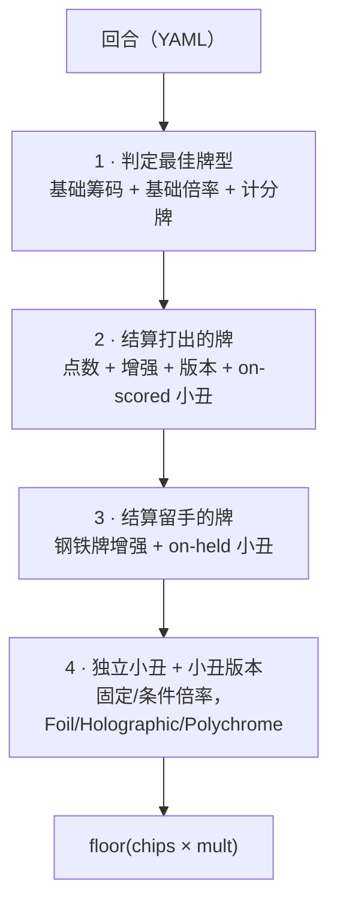

<div align="right">
[English](./README.md) · **中文**
 
</div>
# balatro_rust
 
> 一个用 Rust 实现的《Balatro（小丑牌）》计分引擎：读取结构化的一个回合（打出的牌、留手的牌、小丑牌），通过多阶段管线计算最终得分。
 


 
---
 
## 目录
 
- [项目概述](#项目概述)
- [计分管线](#计分管线)
- [项目结构](#项目结构)
- [小丑系统设计](#小丑系统设计)
- [牌型判定](#牌型判定)
- [复杂规则交互](#复杂规则交互)
- [构建与运行](#构建与运行)
- [输入格式](#输入格式)
- [测试](#测试)
- [技术栈](#技术栈)
- [致谢](#致谢)
- [许可证](#许可证)
---
 
## 项目概述
 
`balatro_rust` 接收一个用 YAML 描述的《Balatro》回合，并确定性地计算它的得分。难点不在算术，而在于**对一个规则相互影响的系统建模**：有的小丑会改变最终判定出的牌型，有的会让卡牌重复触发，有的会复制其它小丑的效果，而每张牌的版本（edition）和增强（enhancement）又会按既定顺序叠加。
 
最终得分为 `floor(chips × mult)`，其中 `chips`（筹码）与 `mult`（倍率）通过下面的管线逐阶段累积得到。
 
## 计分管线
 
入口函数 `score` 依次执行四个阶段。每个阶段接收当前的 `(chips, mult)` 并返回更新后的结果，因此各类效果的**生效顺序是显式且可测试的**。
 

 
1. **判定最佳牌型** —— 在考虑会改变判定的效果型小丑（四指、捷径、涂污小丑）的前提下，找出打出的牌能组成的最高分牌型，返回基础筹码/倍率和真正参与计分的卡牌子集。
2. **结算打出的牌** —— 对每张计分牌先加点数，再应用卡牌增强和卡牌版本；之后再结算 on-scored 类小丑。
3. **结算留手的牌** —— 对仍在手中的牌应用钢铁牌增强和 on-held 类小丑。
4. **独立小丑与版本** —— 应用不依赖具体卡牌的小丑，以及小丑版本（Foil/Holographic 在小丑效果之前，Polychrome 在之后）。
## 项目结构
 
```
src/
├── main.rs                  # CLI 入口；解析 YAML 回合，跑管线，输出得分
├── scoring.rs              # 四阶段管线 + 重复触发 / Blueprint 复制的编排
├── util.rs                 # 点数统计、同花/顺子判定、点数转数值
├── poker/
│   ├── hand_determine.rs   # 牌型判定（从高到低，命中即返回）
│   ├── enhancement.rs      # 卡牌增强：Bonus / Mult / Glass / Steel / Wild
│   └── edition.rs          # Foil / Holographic / Polychrome（卡牌与小丑通用）
└── jokers/
    ├── on_scored.rs        # 卡牌计分时触发的小丑
    ├── on_held.rs          # 对留手卡牌触发的小丑
    └── independent.rs      # 独立于具体卡牌结算的小丑
```
 
## 小丑系统设计
 
核心设计决策是**按"何时触发"组织小丑，而不是按"哪个小丑"**。这与 Balatro 自身的计分模型一致，让每个小丑的逻辑保持小而隔离。三个模块，每个由一个 trait 和一个分发函数支撑：
 
| 模块 | Trait | 触发时机 | 示例 |
| --- | --- | --- | --- |
| `on_scored.rs` | `OnScoredJokerEffect` | 打出的牌计分时 | 贪婪/色欲/暴怒/暴食小丑、斐波那契、惊恐脸、单偶史蒂文、奇数托德、照片、笑脸、长靴与短袜 |
| `on_held.rs` | `OnHeldJokerEffect` | 针对留手的牌 | 举拳、男爵、模仿 |
| `independent.rs` | `IdpJokerEffect` | 每回合一次、与具体卡牌无关 | 小丑、欢乐/疯狂/狂热/古怪/滑稽小丑，狡猾/奸诈/聪明/阴险/精巧小丑，黑板、花盆、抽象小丑 |
 
每个小丑是一个零大小结构体，实现所在模块的 trait 方法 `apply(...)`；`get_*_joker_effect` 函数把 `JokerCard` 映射到对应的 trait 对象（`Box<dyn …>`）。新增一个小丑只需加一个结构体和一个 match 分支，管线本身无需改动（开闭原则）。
 
## 牌型判定
 
`determine_best_hand` 从**最高牌型到最低牌型**依次判定，命中第一个即短路返回，因此总能返回当前可组成的最佳牌型：
 
```
五同花 → 葫芦同花 → 五条 → 同花顺 → 四条
→ 葫芦 → 同花 → 顺子 → 三条 → 两对 → 对子 → 高牌
```
 
判定逻辑由几个"改写规则"的效果型小丑参数化：
 
- **四指（Four Fingers）** —— 同花和顺子只需 **4** 张牌即可成立，而非 5 张。
- **捷径（Shortcut）** —— 顺子允许点数之间存在 **2 的间隔**（例如 `5 7 9 J K`）。
- **涂污小丑（Smeared Joker）** —— 判定同花时花色按颜色合并（♥/♦ 与 ♠/♣ 各算同一花色）。
- **万能牌（Wild）** —— 组成同花时可当作任意花色。
**高 A 顺**（`10-J-Q-K-A`）和**低 A 顺**（`A-2-3-4-5`）均做了显式处理。
 
## 复杂规则交互
 
让这个引擎不平凡的部分：
 
- **重复触发** —— *长靴与短袜* 在计分阶段让人头牌再触发一次；*模仿* 让留手牌再触发一次。这些通过一次受控的二次遍历实现，而非临时的重复代码。
- **飞溅（Splash）** —— 强制*所有*打出的牌都参与计分，而不只是组成牌型的那些。
- **空想性错视（Pareidolia）** —— 让每张牌都算作人头牌，从而改变所有"人头牌条件"类效果。
- **蓝图（Blueprint）** —— 复制右侧相邻小丑的效果；`finalise_blue_print_joker` 在计分前解析这一复制，并正确排除不可复制的小丑（涂污、飞溅、空想性错视、捷径、四指）。
- **版本（Edition）** —— `Foil`（+50 筹码）、`Holographic`（+10 倍率）、`Polychrome`（×1.5 倍率），按正确顺序应用于卡牌和小丑。
- **增强（Enhancement）** —— `Bonus`（+30 筹码）、`Mult`（+4 倍率）、`Glass`（×2 倍率）、`Steel`（×1.5 倍率，留手时）、`Wild`（花色万能）。
## 构建与运行
 
需要较新的 Rust 稳定版工具链（`cargo`，edition 2021）。
 
```bash
# 构建
cargo build --release
 
# 从 YAML 文件计分
cargo run --release -- path/to/round.yml
 
# 或通过标准输入传入回合
cat path/to/round.yml | cargo run --release -- -
```
 
程序输出单个整数：最终得分 `floor(chips × mult)`。
 
## 输入格式
 
一个回合通过 `serde_yaml` 反序列化为 `ortalib` crate 提供的 `Round` 类型，包含三部分：打出的牌、留手的牌、在场的小丑。下面的示例**仅作说明用途**，确切的卡牌/小丑写法请参考 `ortalib` 的 `Round` 定义。
 
```yaml
cards_played:
  - "10H"     # 红心 10
  - "10D"
  - "10S"
cards_held_in_hand:
  - "AS"
jokers:
  - joker: Joker
    edition: Foil
```
 
## 测试
 
单元测试以内联方式（`#[cfg(test)]`）紧挨着对应逻辑，重点覆盖规则组合时最容易回归的部分：
 
```bash
cargo test
```
 
当前覆盖：点数统计、同花/顺子判定辅助函数（`util.rs`），以及牌型判定的边界情形（`hand_determine.rs`）——例如带万能牌的同花、捷径间隔的顺子、低 A 顺子，以确保新增规则不会悄悄破坏牌型判定。
 
## 技术栈
 
- **Rust**（edition 2021）
- [`ortalib`](https://crates.io/crates/ortalib) —— 共享的卡牌 / 小丑 / 回合数据类型
- `serde_yaml` —— 回合反序列化
- `clap`（derive）—— 命令行参数解析
- `itertools` —— 牌型判定中的组合辅助
## 致谢
 
共享的领域类型（卡牌、点数、花色、小丑、版本，以及 `Round` 容器）来自开源 crate [`ortalib`](https://crates.io/crates/ortalib)。本仓库在这些类型之上实现了计分引擎。
 
## 许可证
 
基于 **GPL-3.0** 许可证发布，详见 [`LICENSE.txt`](./LICENSE.txt)。
